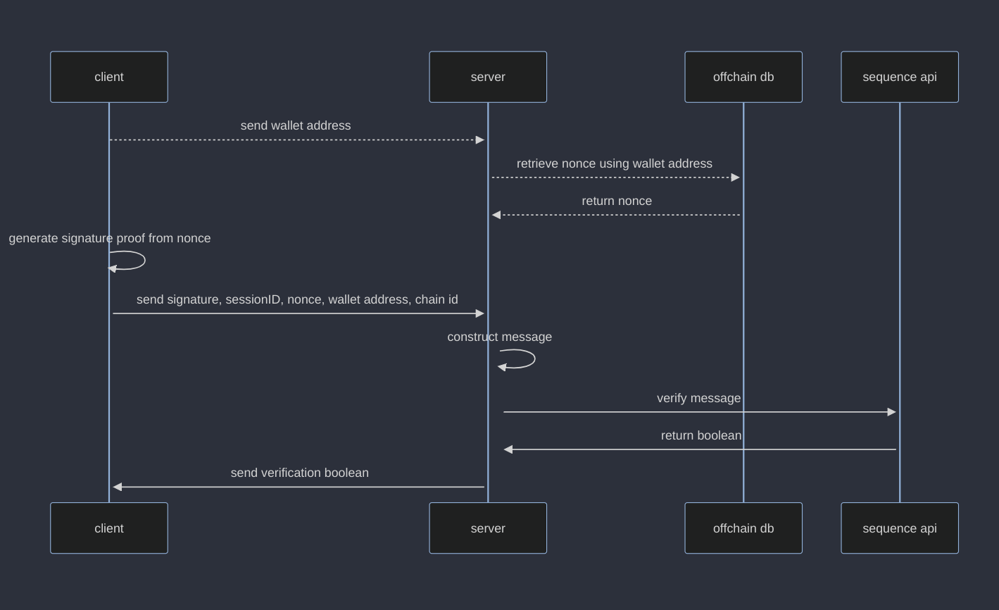

# template-embedded-wallet-verification
verify the ownership of an embedded wallet using a backend nonce storing server

## simplified steps
- user login with web2 provider (e.g. google)
- request nonce from server stored alongisde wallet address
- generate nonce and store on off-chain compute
- generate signature from waas sdk
- send signature with session id, nonce, and wallet address to backend
- verify signature in backend against sequence api and return response

## sequence diagrams
### generate nonce

### verify signature

